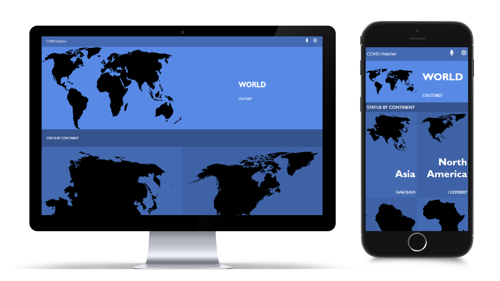

# React - COVID Watcher 


# COVID Watcher

> This application use React framework to implement a COVID cases around the world.

## Built With

- React / Redux
- JS


## Technologies

- webpack.
- JS6 Module.

## Live Demo 

Go to live demo : 
- https://covid-watcher-maen.herokuapp.com/

Demo Video:
- https://www.loom.com/share/4f19718a46b54b77bfa299bb72d39548



## out resourse
### API source 
https://rapidapi.com/vaccovidlive-vaccovidlive-default/api/vaccovid-coronavirus-vaccine-and-treatment-tracker/

### image source
https://svgsilh.com/tag/continent-1.html

## Getting Started


**First open VS code**<br/>
**From the VS code terminal navigate to the folder where you want to download the project**<br/>
```
$ git@github.com:maenkhraisha/react-capstone-project.git
```
```
use npm install
```
```
use npm start
```
```
npm test
```


### Prerequisites
VScode


## Authors

👤 **Maen Al-khraisha**

- GitHub: [@githubhandle](https://github.com/maen1980)
- Twitter: [@twitterhandle](https://twitter.com/AlkhryshaM)
- LinkedIn: [LinkedIn](https://www.linkedin.com/in/ma-en-mohammad-303930100/)


## 🤝 Contributing

Contributions, issues, and feature requests are welcome!

Feel free to check the [issues page](../../issues/).

## Show your support

Give a ⭐️ if you like this project!

## Acknowledgments

- Design is inspired from a design made by [Nelson Sakwa](https://www.behance.net/gallery/31579789/Ballhead-App-(Free-PSDs)).
- Linters are made by [Microverse Inc](https://github.com/microverseinc/linters-config/).

## 📝 License

This project is [MIT](./MIT.md) licensed.